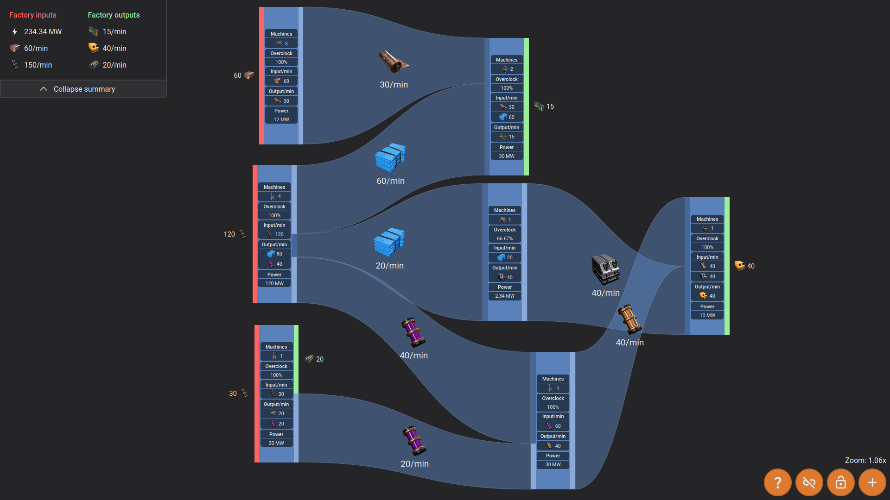

# Sankeyfactory
A tool for planning Satisfactory production chains with convenient sankey diagram view.

The tool: [https://sankeyfactory.github.io](https://sankeyfactory.github.io).

The recipes are up-to-date with Satisfactory version `0.8.3.3` (Update 8 latest patch).

[](https://buymeacoffee.com/andev0)

## Table of contents

- [Screenshots](#screenshots)
- [Building](#building)
    - [Dependencies](#dependencies)
    - [Compile](#compile)
    - [Generating Satisfactory data files](#generating-satisfactory-data-files)
    - [Exporting Satisfactory icons](#exporting-satisfactory-icons)
    - [Building web application](#building-web-application)
- [Extracting the game files](#extracting-the-game-files)

## Screenshots

<details>

<summary>Show screenshots</summary>




</details>

## Building

### Dependencies

First of all, you'll need [npm](https://docs.npmjs.com/downloading-and-installing-node-js-and-npm).

Once it is installed, you can use it for the project dependencies:

```bash
# This will install all required dependencies.
> npm install
```

### Compile

```bash
# Runs typescript compiler to check validity of the code.
> npm run compile
```

### Building web application

```bash
# Builds application's TypeScript code to runnable by browsers JavaScript.
> npm run build-app
```

Once the web application is built, it can be viewed in browser by opening `dist/index.html` file. It doesn't need a server to run.

> Note that already built files can also be found in `gh-pages` branch of this repository.

### Generating Satisfactory data files

```bash
# Builds and runs the tool on NodeJS.
> npm run export-satisfactory-data
```

### Exporting Satisfactory icons

First, you'll need to export original icons from the game. See [Extracting the game files](#extracting-the-game-files).

Once you have the icons, they can be automatically copied and renamed by a tool to `dist` folder.

```bash
# Builds and runs the tool on NodeJS.
# RESOURCES_DIR should be set to a path where you exported icons to.
# For example: `RESOURCES_DIR=Path-To-FModel/Output/Exports/FactoryGame/Content`
> RESOURCES_DIR=... npm run export-satisfactory-icons
```

> Note: RESOURCES_DIR is a environment variable and it can only be set this way on UNIX systems.
> If you're using Windows, setting the environment variable should be performed another way.

## Extracting the game files

If you want to extract data from Satisfactory for developing tools like this one, here is what I used:

1. File with all the in-game recipes: `Satisfactory/CommunityResources/Docs/Docs.json`

    > Note: My tool converts the recipes from there into a more convenient format for my needs. If it's what you are seeking - look at the `gh-pages` repo branch.

2. [A tutorial for extracting game files](https://docs.ficsit.app/satisfactory-modding/latest/Development/ExtractGameFiles.html) such as icons.
